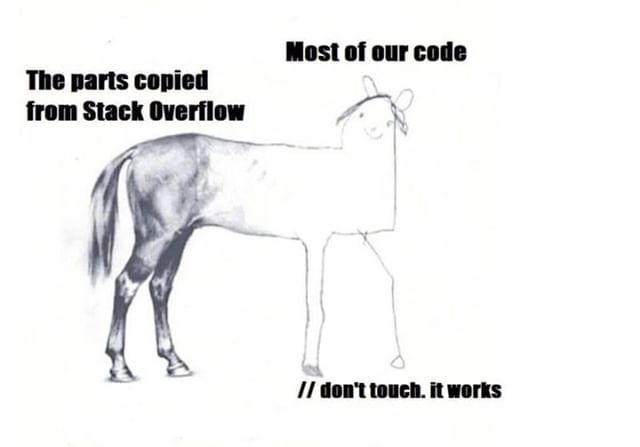

Most people think hacking is basically writing hundreds of green lines on a fancy-looking terminal. Well, maybe it is, but it's damn hard for sure. Computers don't get hacked by pushing a button. I recently participated in a CTF, and it was fun.

<!--more-->

So here's what I think about hacking. The information or facts might not be completely true, since my experience in hacking is just 2 months.

I recently participated in [Amrita InCTFj](https://www.inctf.in/) (Indian CTF competition for students). I haven't participated in other CTFs before, so can't give a comparative analysis, but it was quite difficult and fun.

Since I had never done any hacking in a real sense before, it took some time for me to understand stuff. Even though I knew Web development, JavaScript and Python, I had to learn the intricate details of everything I knew. That's what makes hacking different from development or programming.

## Why Hacking Is Different (And Perhaps Difficult)

I have some experience with Web Development and Python, as I said. (Can't tell exactly how much as I have stopped trusting my own confidence after learning about the Dunning-Kruger effect) But as soon as I opened the first challenge, I had no clue on what I need to do next. I could very well see the website's source code from the DevTools, but nothing seemed to be interesting about it. The reason for that was that I was looking at the website from a visitor/developer perspective, and not from the perspective of a hacker.

> A quick notice: Most of the challenges in the competition were quite easy and meant for Juniors (students) and were no match for professional advanced CTFs.

In this blog post, I just want to explain the difference between
a programmers perspective of looking at software and a hacker's perspective.

As a programmer, I never thought of every intricate detail of my own code many a times, since lots of lines are borrowed from other sources like StackOverflow and GitHub.

But as soon as I started playing the CTF, I started spending hours trying to understand just a few lines of code from the challenge. Developers seldom require all details of a particular library or external pieces of code. But your primary job in hacking is to _break_ stuff, and especially _computer stuff_ with well-defined logical rules of what will works and what doesn't.

## We All Love to Break Rules

If I tell you some of my examples, you will easily be able to recall how even you might have done something _similar to_ hacking in real, day-to-day life.

- In my school, regulations about the school uniform are quite stringent, and the prefectorial board of students used to check it regularly while dispersing from the assembly. After 3-4 years of experience in trying to escape from getting caught with loose socks, many children like me were exceptionally good at avoiding being caught. This was done by either talking with a teacher while moving out in the line, or walking beside a person who had tight socks such that your socks are not payed attention to, or drawing the prefect's attention to one's face so that he/she doesn't notice the socks.

- Many students are exceptionally good at hiding incomplete homework in front of teachers (even though teachers think they can figure out everything, it is rarely the case). There are numerous different ways in which this is done, and it is a matter of absolute expertise (so no need of explaining here).

These are just a few examples I have encountered as a school student. However, you might have experienced similar tricks in some other fields too. I would even call these things are "hacking". This is how we all hack everyday rules and social systems. Hacking computer-based systems is quite analogous to the given examples. The only difference is that in hacking software, you have to break the rules of the programmer's code who made the software instead of the school's uniform rules.

Just like breaking uniform rules required 3-4 years of experience in the school, hacking software and computers also requires you to know each and every thing about how computers, the internet and the web works. Abstract knowledge of stuff doesn't help. Once your brain is able to comprehend each and every step of what happens after pressing the `enter` key on a web browser's address bar (DNS queries, HTTP requests, server-side processing, databases, HTTP responses, rendering html etc.), you can start figuring out creative ways of hacking (breaking into) a web application or website. Or once you know each and every step of how a process starts, executes, and ends in an operating system, and how a CPU executes instructions from the memory, you can find creative ways of pwning a software.

Hence I think, hacking comes as natural to human beings as breaking everyday rules does, just that it deals with computers.

## Conclusion

Popular to contrary belief, breaking things isn't as easy as making things sometimes, at least in a software. Hacking requires tremendous mental energy for figuring out various creative ways in which things can be exploited. Reverse Engineering also requires you to reverse the entire logic of program, to get the desired information. Each hacking challenge is just another puzzle, or a riddle you have to solve. Here is a good python reversing challenge I found in the competition, try to find the flag :)

**Name:** Atomic Swap

**Description:**
A basic xor and a lot of shuffle makes this challenge what it is. But the shuffle is unlike what you have seen XD.

The flag variable will contain the actual flag, which you must recover.

The encrypted flag printed using the script is the below one,

`b'@\x13Z1Z\x18:E\x03\x1b\x18\x18:\x01\x14\x1d\x1a\x0f\x11\x15\x1e\x1aF\x1a\x19Y\x17Z\x02\x02'`

**Note:** The output is in python bytes format, so make sure you know how to work with python bytes. Python bytes and string are different, try learning about bytes.

FLAG FORMAT: `inctfj{flag_here}`

**Challenge File:**
[https://gist.github.com/Quat3rnion/6f982cc1c1101392d5a50f07c834f30e][def]

[def]: https://gist.github.com/Quat3rnion/6f982cc1c1101392d5a50f07c834f30e
