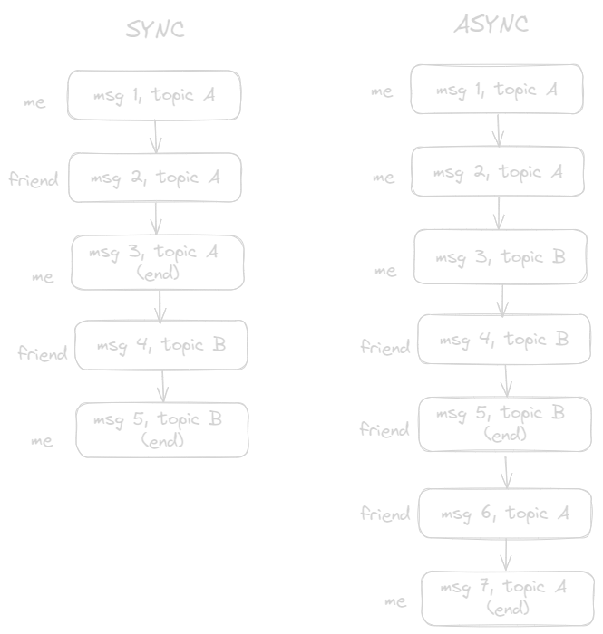

As the readers might have guessed it, this article is neither about a 🌀 nor a 🏋️‍♂️. It begins with one of the gazillions of absurdities of YavaScript, or so I had thought in excitement. As soon as I figured out the word "synchronous" meant "happening at the same time, simultaneously", I was jumped up about knowing another reason to call YavaScript stupid. Well, that is only until I began to learn more about concurrency.

The following text is me trying to explain concurrency to my 1 week younger self, which is what is covered in this post. The upcoming posts will deal with YavaScript language specifics. As the great Richard Feynman had onced confessed,

> You know, I couldn’t do it. I couldn’t reduce it to the freshman level. That means we really don’t understand it.

. . . except that I need to reduce it to script kiddie level. If I do a great job at explaining concurrency, and later, a specific case of YavaScript concurrency, I can pat my back and have a good night's sleep. But, knowing that it is not the 1 week younger self that is going to read this, I ought to caution the readers that I myself am no expert, and that I have no formal degree in any academic subject yet. Having said that, I will do my best to [make it intuitive enough](./about-teaching-computer-science/) for anyone who resembles my 1 week younger self, such that they can grapple with YavaScript concurrency for all practical purposes.

## It is All a Lie

Yes, concurrency is a lie. It is an illusion. But when it comes to scientific wizardry, an illusion can serve purposes beyond mere entertainment. The moving images of cinema are an illusion, but they do indeed move in your head (and ironically do serve the purpose of entertainment, as I realised after writing it). When it comes to concurrency, assuming we have an old ass single-core CPU, it by definition is going to execute one operation per clock cycle (I hope you atleast know that a CPU essentially just executes simple instructions). Imagine a CPU to function like a pendulum clock.

Every time the pendulum swings, a statement is executed (actually, no. it takes a few cycles to execute one instruction, but for all intents and purposes, this is irrelevant). Keep this picture of the CPU in mind as it will be useful later too. 

> In fact, this is where you get the terms like "clock speed".

For now, this is enough to prove that a simple single CPU core never actually executes multiple things at once. Instead, concurrency is a clever illusion created by what's called _time slicing_, or [preemption](https://en.wikipedia.org/wiki/Preemption_(computing)). 

## Preemption — The Truth

To explain this, I am going to use an oddly specific and personally nostalgic ordeal as an analogy. I once had this friend who talked with me on Discord. Now initially, we were too awkward to talk about more than one thing at once, but the amount of things we had to discuss grew proportionally to our friendship. Eventually, there was a time when we yapped about so many things in a day, that when either one of us came online, there was a catalogue of different topics to respond to. Now it was technically impossible for us to stay online the entire day and respond to each message as soon as it arrives, so sequential responses were impossible. What we did was what anyone would do, pick out the interesting messages and reply to those first. The topics we chose to respond to were in no particular order (keep this idea in mind). If one were to fast forward these days into seconds, it would seem as if multiple topics were being discussed concurrently, and also that our friendship ended surprisingly soon. 

This is a satisfactory analogy for preemption, as what happens in the latter is that seperate threads are _paused_ and interrupted by other threads. A thread keeps executing until it is interrupted. This happens recursively and fast enough to give an illusion of concurrent execution of all the threads. Next time you see the "System interrupts" process in your task manager, keep in mind that doing this is what it is responsible for.

> While this is the case for multithreading, modern CPUs **can** leverage multiple cores to execute multiple instructions at once, but given that many programs use thousands of threads, and that there only a few cores in most CPUs, it is almost always the case that individual cores will also use preemption to make these threads work simultaneously.

This was all there was to talk about concurrency. However, before ending the article here, I also need to address one very common misconception of YavaScript script kiddies.

## A Sink is Born

What does synchronous mean? It is a bit confusing to explain the word "synchronous" in computer linguistics, as colloquially we use it to refer to systems that occur simultaneously. For this reason, I prefer to explain it by saying "synchronized" instead of "synchronous", as it seems to get closer to what we want to refer here. What exactly is being synchronized in a CPU trying to execute instructions? The answer is timing. The end of one instruction is synchronized to the start of the next instruction. This is what synchronous generally means in computer science. As we are not typically interested in looking at individual CPU instructions, we use the word "synchronous" in programming languages to refer to anything which is clocked to a source. The precise definition of synchronous and asynchronous code will vary from language to language, but this is the most general information they all try to convey: synchronous stuff is usually like clockwork, meanwhile asynchronous stuff is usually arbitrary.

For example, if we take our previous messaging analogy, here's what the distinction should look like.

It is important to note that even synchronous stuff may theoretically, but not necessarily, be parallel if we stick to this idea. That is, either synchronous or asynchronous stuff may or may not be parallel, and the concept of parallel execution is not exclusive to either of these.

Notice that most of the natural human interactions are asynchronous, and even our brains think about multiple things simultaneously, with new thoughts invoked arbitrarily without being clocked to a source. With this, our groundwork in concurrency has been laid. Now we shall tackle one of the most notoriously famous problem among rookie YavaScript script kiddies in part 2 of this series. The key takeaway here is that the concepts of synchronous and asynchronous code are not tied to the concept of parallelism, wherein none of these can actually **guarantee** parallel execution of tasks, but simply refer to the manner of execution of several tasks. Hopefully, I made you confused enough to learn more in-depth and not take my word for everything I told you.