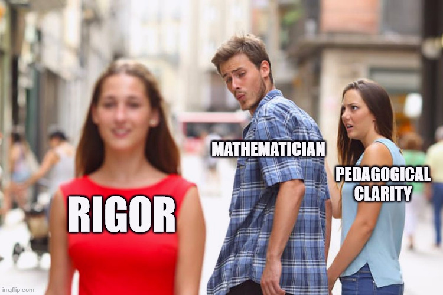

I recently watched Grant Sanderson's (the man behind [3blue1brown](https://www.3blue1brown.com/)) [lecture on Math's pedagogical curse](https://www.youtube.com/watch?v=UOuxo6SA8Uc) at JNM 2023, and I think that it is a very interesting topic which I would like to loosely extend to programming and computer science in general. He talks about how rigor is a gift to mathematics but it simultaneously decreases the pedagogical clarity if given too much focus on. This, he says is the math's "pedagogical curse". 

Now, I totally agree with this notion and I love math too, but for the sake of this article lets focus on computer science.

## learning versus information

What's the most informative document for programmers? Documentation, of course. But we all know how boring and painful reading the documentation is. While it is important to provide the correct information, developers are enticed to writing more exact documentation for their code. But the seperation between documentation and learning resources must be kept. There is a tradeoff between learnable and informative resources. 

I am writing this short post just to tell the readers that any tutorials/explanations I provide on this blog will focus on pedagogical clarity *more than* information dense text. This means that I will focus more on providing analogies and abstractions. You are advised to read books and documentation when actually learning the topic in detail, or using it in your projects, my job is to get you curious enough to dig into the details.

> Side note: While trying to provide abstractions and analogies, I might also give inaccurate details of some concepts, so please consider them as what they actually are, abstractions. 