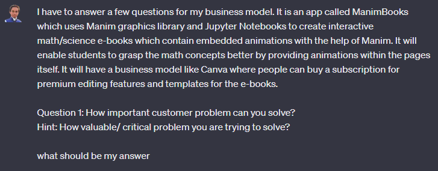
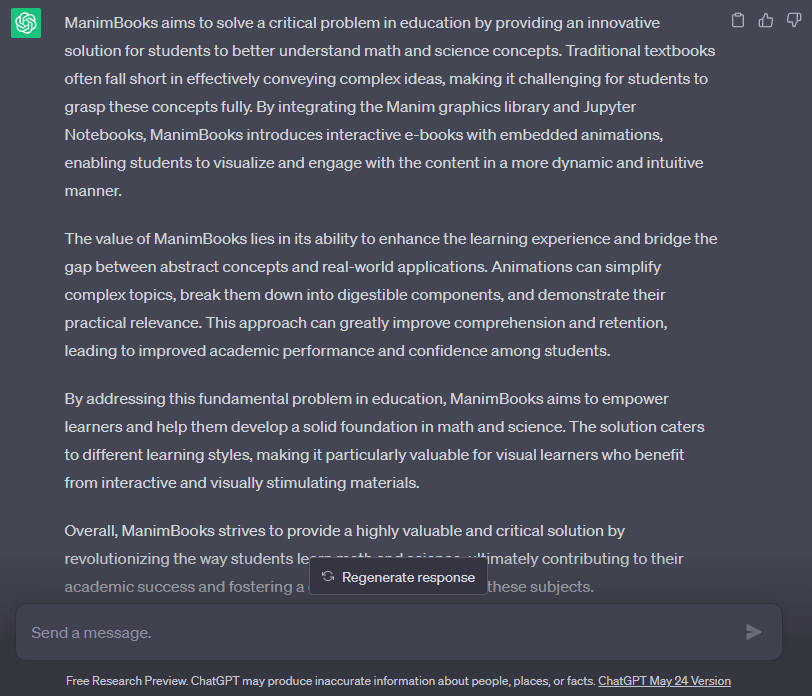
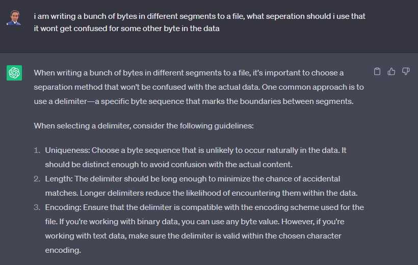

Let's start straightaway

> Will AI affect jobs?

Yes.

>Does it replace developers?

No.

>Wait, so will it affect jobs?

Yes. 

>How will it affect jobs without replacing them?

I had to write a small report (a questionaire) about a project for my school. I have written a lot about that project earlier for other purposes, so it shouldn't be difficult right? Well, I had 30 minutes before submission, and I stared at a blank Word document for 10 minutes. Great, 20 minutes left. I went to chat.openai.com and. . .

Yup, and here it goes 

It wrote all my answers (5 pages of text) in 5 minutes. In the remaining 15 minutes I carefully editted the errors and made the answers more specific to the app by adding a few details. *(haha now don't be silly it's just an estimate)*

## we are bad at getting started

Have you ever felt that excruciating pain of having 100 things in your mind but just not able to start anything?

When I am developing an app. I spend half an hour just inside my brain thinking about how the various processes will work and giving a structure to the app itself. Now as soon as I open Neovim (I use vim in arch btw), I just kind of stare at the screen, quite frankly  ¯\\\_(ツ)_/¯. My brain is just so tired after all the thinking and planning that implementation seems like building a palace from scratch in just one go. But it doesn't have to be in one go. After days of procrastination and a sad realization of this fact, I eventually start with very basic stuff, while I had already forgotten 50% of the structure my brain had imagined earlier. 

There are two hard things for any creative work:

- idea
- getting started

And it seems when the brain is about to do either of those, it gets too tired to do the other. When you get started, you forget what you are supposed to do. When you figure out what you are supposed to do, you don't get started. 

## what AI does

AI helps you reduce your creative fatigue. I knew everything I was supposed to write for the answer of those questions. In fact, I know everything I am supposed to do while implementing a feature, or starting a new project itself. But I just can't start. Just like the prompt I showed above, tools like GitHub Copilot make your life easier by being your copilot. It's so accurately named. You can throw out raw thoughts from your brain onto the screen, and it will start applying the paint. I am also interested in drawing portraits and stuff. The first thing you do is throw out some inaccurate lines which vaguely resemble the shapes from your reference. With techincal tasks like programming or documentation, you can't just start with vaguely resembling work and improve upon it. You need some concrete syntax, boilerplate and stuff that actually does something. 

AI helps with just that. You can throw out random ideas, and it will create a basic implementation. Of course, you wouldn't trust it and edit it only like a thousand times. But it gets you started in doing stuff. 

## doing stuff

What do we do? No, I mean seriously, what do we do most of the time while working? Well, probably for me, it will be 40% thinking and imagination, 10% writing code, 50% refactoring. Time works relatively in our minds, and according to my mind, this is how its work is distributed. 

You see, even though at first glance you might intuitively think that writing code is the majority of your work, it isn't. Humans are really really good at making things "better" but not making things themselves. We start with some shitty code and keep making it better and better until finally shipping it. 

Refactoring and imagination is our real job. AI starts making decent things, and then you just have to improve it. 

> It wrote all my answers (5 pages of text) in 5 minutes. In the remaining 15 minutes I carefully editted the errors and made the answers more specific to the app by adding a few details. 

If I didn't use ChatGPT, I would have probably taken 2 hours for this. An hour getting basic answers ready, and another hour perfecting them. 

So did it make me more productive? YES. Alright alright, what about code then? 

Well for programming AI does two very important things:

- explaining stuff
- write boilerplate 

While most people know how good it is at writing boilerplate, I also found it incredibly useful for explaining things I have not used yet. I don't have a lot of experience in programming. So, most of the time I need to understand how certain things work. For example, here's something I asked today itself: 

It is really great at these things. *Yeah now go on and laugh at me for not knowing how to use delimiters*

## impact on jobs

So I assume you might understand how it is going to affect jobs. I heavily criticise people hyping about how AI will write all of your code. I think generative AI still comes nowhere near to an engineer's reasoning skills. You still need developers. They aren't going anywhere. But it will assist the developers in a way such that they will be way more productive. Since every developer will get more productive, eventually the demand for more workforce might decrease, and that's how it will affect jobs. It won't replace them, it will make them faster and more productive.  