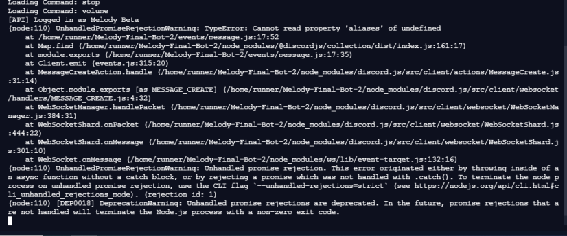

A question I get asked surprisingly often by my friends is how I learnt "coding". First of all, I hate to call it "coding", and being called a "coder", but that's how "non-coders" see it. There is quite a misconception about how programmers work, and what programming is in reality.

<!--more-->

When I am asked this question, most of the time I escape by saying that I learnt to program by watching YouTube tutorials or courses and reading blog posts. Because the true story is a bit complicated. I did watch YouTube tutorials and read blog posts, but that's not exactly how I learnt to program. I learnt programming as a desperate attempt to understand code. Let me explain the journey.

## as everyone else does

So I guess most people start learning by taking up a professional course on some platform, like [Codecademy](https://www.codecademy.com). Even I did that, 2 years back. I started with their C++ course and completed about 50% until I was too bored. I learnt about declaring variables, doing arithmetic, creating loops, printing output and inputs to the console etc. I started thinking that it's all there is to coding. I know most of the stuff [the Dunning-Kruger effect](https://en.wikipedia.org/wiki/Dunning%E2%80%93Kruger_effect)). But in actuality, the only thing I knew was to install Microsoft Visual Studio, Python, and Node.js, (and pretty much do nothing with any of those) and make a [simple console calculator in C++](https://github.com/CyLicon/Simple_Calc). Nobody I knew was able to do so much in my school, so I was satisfied and did nothing but watch YouTube.

## youtube videos and hacking

Once I got bored of console calculators, I started watching some interesting content from [NetworkChuck](https://www.youtube.com/user/NetworkChuck) on YouTube. I installed [WSL](https://docs.microsoft.com/en-us/windows/wsl/) and did some basic Linux cybersecurity stuff. Though the only thing I learnt successfully in cybersecurity was to [phish my friend](https://youtu.be/u9dBGWVwMMA), I learnt to manage my Linux instance while trying to troubleshoot various errors and patch the VM regularly.

Then I saw his videos about [Raspberry Pi](https://www.youtu.be/dH3DdLy574M) and tools like Docker and Kubernetes and eventually got interested in cloud and IT infrastructure . . . (I randomly jumped to different topics while learning stuff). I knew quite a bit about Linux now, and how to manage Linux machines through the CLI. [Scott Hanselman](https://www.youtube.com/c/shanselman) made me a CLI person because of his custom prompts and windows terminal customizations. I started using multiple Linux distros through WSL and got myself familiarized with them. I wanted a cloud account and get started with server-side things, and hosting my own VPN, but a credit card is the most annoying thing that every cloud provider asks while signing up. So I asked my father for the same, and he created an Oracle Cloud account. (They give a lot of "[Always Free](https://www.oracle.com/cloud/free/)" services by the way).

## linux server administration

Since Oracle Cloud provided 2 free virtual machines when we signed up, I used one of them for my experiments and hosting unofficial stuff. I hosted A LOT of stuff in the next few weeks. Examples include [Pi-hole](https://pi-hole.net/), [OpenVPN Access Server](https://openvpn.net/access-server/) and [Nextcloud](https://nextcloud.com/). In the process, I learnt many Linux server admin things, by referring to blog posts and articles and troubleshooting issues. So now I knew how to manage docker containers, processes, firewalls, and system resources in a headless Linux server instance with public IP. And since we own the domain `kush.in`, I even created the subdomain `lab.kush.in` for the server's public IP. And so again I thought I knew how IT works (But I didn't).

After all this, I was dormant for a few months and didn't do anything new but watched YouTube videos again. But soon, one of my friends made a Discord music bot from some tutorial. I was interested in hosting the bot and asked for the same. He agreed to host the bot on my server. The bot was written in JavaScript and required NodeJs. None of us had any idea how we were going to run the bot. I literally googled "how to run Node.js project on Linux" that day, because we knew only to click the run button of VSCode and [replit](https://replit.com/) (read my [blog post](./how-to-not-learn-computer-science/) about this problem). Then when I successfully executed the code, we both were immensely satisfied by seeing the bot come online (for different reasons). But as soon as I closed the SSH connection and my terminal, the bot stopped. And we literally troubleshoot the problem the whole day: How to keep a NodeJs process running after closing the terminal. (I still laugh at how trivial that was)

This was basically what we did every day. Every time there was some issue, we used to google it, find the best StackOverflow answer, and change the code accordingly (We seriously didn't understand any code except the message embeds). But then sometimes the StackOverflow solutions didn't work, and the errors made us crazy.

## learning to code

So that's basically it. I learnt programming by troubleshooting errors in the bot :joy:. Then we realized that the person from whom we had cloned the repository was on version 4 of his bot, and our bot was still the same, crashing twice a day and having the same basic functionality. I learnt serious JavaScript by trying to understand what that guy had updated, and what the new code does. In the coming weeks, I added most of his functionality from his bot to ours by writing code myself and taking references from his repository sometimes XD. Soon I started watching more videos about programming and learnt JavaScript along with adding functionality to the bot.

After all this, I also wanted to automate some processes, like restarting the bot nightly, updating directly without me having to SSH into the server and doing a `git` pull to pull in new changes every time. So eventually I got started with CI/CD, Docker containers and [Github Actions](https://github.com/features/actions). We even struggled to create a cluster for the bot, since at the time it crashed too much with the load. So in the coming months, I made the docker image for the bot, set up CD workflow from GitHub Actions, and created a [Lavalink](https://github.com/freyacodes/Lavalink) Docker Swarm cluster for sending audio. The bot's working fine right now is present in 382 discord servers (At the time of writing this post) and has thousands of active users.

Currently, I am still learning and making many things. I would highly recommend watching [Fireship](https://www.youtube.com/c/fireship) (YouTube channel) and start making apps if you have basic programming knowledge and want to get started with Web development or JavaScript. You should definitely start a project which you don't understand yet, you will learn programming while making the project. Don't go for beginner courses or huge monotonous coding tutorials if you wish to learn to program.

That's it, thanks for reading :)
