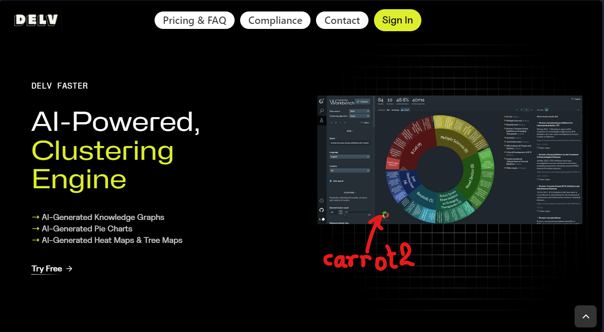
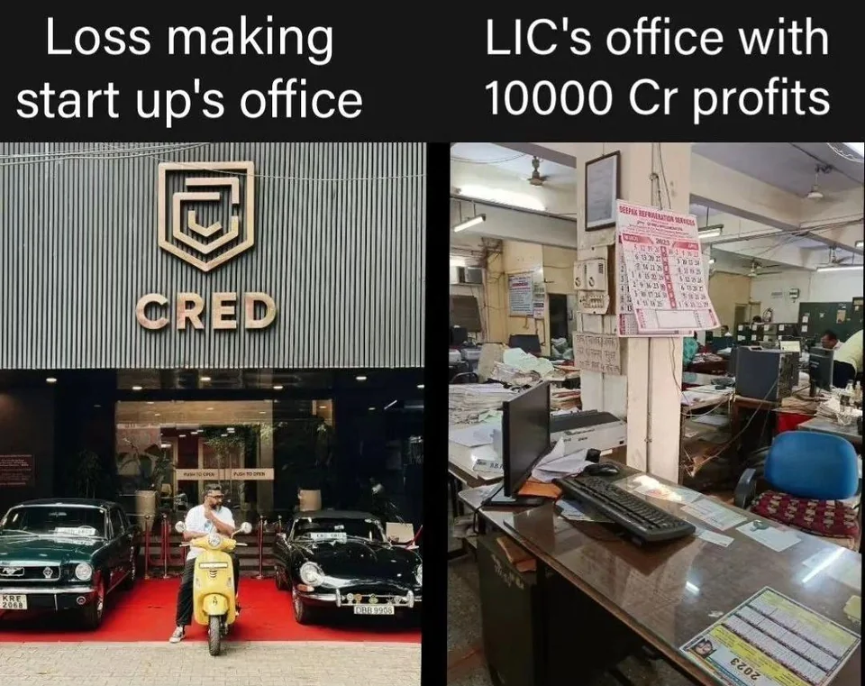

If you come across a headline like "[A 16-year-old Indian girl launched an AI company in 2022, it is now valued at Rs 100 crore](https://www.businesstoday.in/technology/news/story/16-year-old-indian-girl-launched-an-ai-company-in-2022-it-is-now-valued-at-rs-100-crore-401309-2023-10-10)" today, wouldn't you be surprised? How inspiring! India is growing, the kids here are extremely talented. Or is it :face_with_raised_eyebrow:?

## this delve ai thing

Pranjali Awasthi started an AI startup called [Delv AI](https://www.delv.ai/) that claims to "aid researchers in efficiently accessing specific information within the ever-expanding realm of online content." Whenever I hear bold and fancy claims like this, I always investigate what their product really is. Overuse of such claims in the Indian tech industry has made me a big skeptic. 

So what does delv do? It basically reads a number of academic documents (PDF files), and uses the context to answer questions. Even though there are a hundreds of websites popping up to do this exact same thing already and even the built-in bing pane in microsoft edge answers questions from any website or PDF that you have opened, for free (see screenshot below), delv has raised $450,000 in funding and gives an approximate valuation of $12 million. Which, in India, is a LOT. I mean, seriously, with that money you could literally buy a large mansion in a metro city.

In fact, I just figured out that the screenshot which they are showing as an example of "AI-Powered Clustering Engine" is not even from their product, it is an open source project called [Carrot2](https://search.carrot2.org/#/about)

Alright, now moving on to what their "tech" startup really is according to me. This girl has used a number of open source LLMs, or paid API's from big AI companies like OpenAI's ChatGPT, open source products (Carrot2) and made a nice looking website to upload PDFs and a prompt UI to ask questions to the LLM (although I wouldn't really call it particularly "nice", it has design flaws). In fact, I could even pay a freelancer to make this crap in a week's time and it would be better.

## from a long trail of scams

Money-laundering scam startups is nothing new in India (and even elsehwere). I stumbled upon an absolutely horrendous scam called "Qpi Techonology" that made utter ludicrous claims about using "quantum simulations to make high energy density solid-state batteries". In fact, if you happen to visit their [website](https://qpitech.holdings/), which looks more suspicious than a microsoft tech support scam, every other sentence uses the words "quantum" and "AI" in it. They literally boast about everything ranging from SSBs, cloud infrastructure, quantum computers, semiconductors and what not. 

The sad thing about this fraudulent startup nexus is that the naive media [showcases them](https://www.livemint.com/brand-stories/qpivolta-announces-india-s-first-indigenous-high-energy-density-lithium-metal-based-ssb-pouch-cell-11678083287215.html) as real innovation to create an optimistic narrative to lure foreign investors.

## the not-so-scam startups

Alright, I get it. These are just scams that will obviously be exposed at some point. But what about the real startups? Isn't India producing an insane amount of unicorns every year? What about the e-commerce, fintech, edtech startups that are booming up? 

According to me, those are not wrong, but simply overvalued. I am not an economics expert, but even if they are not overvalued from the money standpoint, they are definitely overvalued in terms of popularity among students and youth. 

If we look at the startup's that have risen to fame in India, you will find that the big fish are usually e-commerce, fintech or edtech startups which manage to gather an insane amount of funding and the small fish are the DIY (_jugaad_) solutions to trivial problems that get highlighted on social media and shows like shark tank. Most of the big fish are the ones which focus on milking the 1% lazy rich Indians to deliver a _gulab jamun_ and their diabetes tablets at their home via their iOS app, while the remaining are coming up with solutions to make you buy fake internet coins with a shiny UI on the new [bullshit](https://www.stephendiehl.com/blog/web3-bullshit.html) AKA Web3 (did I mention there was [supposed to be a Web5 too](https://m.economictimes.com/markets/cryptocurrency/web-3-killer-jack-dorsey-announces-bitcoin-based-web-5/articleshow/92160764.cms)). 

Let me make it clear that I'm not an ultra pessimistic conservative who wants the good ol' days back. Being a developer myself, I have just seen the outrageous reality of the much-hyped Indian startup industry. The reality is that most of these so-called startups are just fancy dashboard UI's and a simple backend which wouldnt take 2 months to build.

> Oh, but Kush what about the idea and innovation! Startups are not about the mobile apps or websites but the underlying innovative idea!

Partially true. I agree that you should not be too excited about opening a wood cutting business that your grandpa once did. But look, even things like e-commerce have reached a saturation point now. Whatever can possibly be ordered online is already being sold online. YOU SIMPLY DO NOT NEED ANOTHER COMPANY TO DROP STUFF AT YOUR HOME.

I consider value-creation as something way more important than the cleverness and ingenuity of  companies like CRED to fill their pockets (which they haven't quite yet). I see businesses as a tap connecting a reservoir of resources and money to provide valuable products in a streamlined way. Pause for a while and think, how much exactly will a company contribute to the value of the overall economy of India if the only thing it does is earn revenue from credit card overdues. And yet, look the ridiculous amount of fame they have got.

## startups as "get rich quick" schemes

Are you in a tier 3 college? Don't worry. Studies don't matter nowadays. Education is obsolete. All you gotta do is think about something which you can make everyone buy. It doesn't need to contribute much in their lives. First, create the supply. Create a simple backend with a NoSQL database running on a SaaS platform because you haven't learned SQL and system administration yet, a simple frontend using React because you don't know vanilla javascript yet. Then spend your time in creating artificial demand. Make people feel how much they need your service. In fact, you don't even need to convince the actual customers, just boast about what your stupid website can do in front of filthy rich investors. You don't need to create a unicorn anyways, a couple million would do. Once you get them, sell the startup and bam! You have earned enough to be jobless for a lifetime.

This is exactly what thousands Indian students are thinking right now. You can't question them, because the startup industry is growing in India. They have this false sense of pride and achievement with creating a useless startup. The government, the parents, your peers, everyone is talking about startups. I'm not against startups, in fact, I encourage them, as long as they are done with the correct mindset.

## the correct mindset

Most startups fail because they are solving non-existent problems. What is your motive behind creating a startup. Is it a problem that has been genuinely bothering you for a while? Or is it what I described above? Are you seeing your startup as a solution to a legitimate problem or as a solution to your lack of skills to get a job? If you had a legitimate problem, and your startup fails, you wouldn't cry. You have other ways in mind to solve that problem. Success of the particular idea wasn't necessary, the necessity was in that problem getting solved. 

The second question you must re-evaluate is how much money and resources you seek in return for the value that your startup generates. Does your startup really help create enourmous value for the people? If yes, then you do deserve to be a millionaire.

## so why India?

All this time I have been trying to criticize the startup culture in India. But why only in India, you ask. These kinds of bubbles and scams happen even in the big economies like the U.S, then why am I targetting the Indian startup market specifically? This reality check is for those Indians who are overly optimistic about the future of India. I'm not saying you shouldn't be optimistic, but you must also consider the following facts:

- We are so focused on the service sector and "coding" skills that our manufacturing sector is lagging behind all the major economies. 
- We don't have a single prominent indeginous smartphone manufacturing company yet. We don't even manufacture the required parts to assemble a smartphones and laptops.
- Our semiconductor industry is way behind competitors. As a last resort, our government has to lure foreign companies to manufacture in India by providing huge incentives, and even they are hesitant to come here due to lack of skilled engineers.
- Talking about software, we don't have large companies that specialize in building software, like Google or Microsoft. All we have is huge consultancy and service related companies.
- Our basic transport infrastructure is one of the worse in the world.
- We are lagging behind in the race for EVs and sustainable development products.
- We have very low agricultural efficiency compared to other countries.
- We have no significant AI companies (that produce AI models, not use them)
- Our scientists managed to land a rover on the moon for $75 million, while our military is considering in spending $3 billion on US-made drones that cost around $100 million per unit.
- Most of our military equipment is imported, and out of date. Indeginous equipment lacks the quality of the international standards.
- Expenditure on R&D is very low, and quality of research is very poor.

If you heard the headlines which I mentioned in the beginning of this article, why don't you ever hear headlines like [OpenAI debuts DALL-E for generating images from text](https://venturebeat.com/business/openai-debuts-dall-e-for-generating-images-from-text/), [Toyota And Idemitsu Team Up To Make 621-Mile Solid-State Batteries A Reality](https://insideevs.com/news/691084/toyota-idemitsu-solid-state-battery-ev-2027/), [IBM makes major leap in quantum computing error-detection](https://phys.org/news/2023-08-ibm-major-quantum-error-detection.html), [China completes first operation of world's fastest train that travels at 600 km/hour](https://www.cnbctv18.com/travel/china-completes-first-operation-of-worlds-fastest-train-that-travels-at-600-kmhour-16321471.htm), [NVIDIA, ASML, TSMC and Synopsys Set Foundation for Next-Generation Chip Manufacturing](https://nvidianews.nvidia.com/news/nvidia-asml-tsmc-and-synopsys-set-foundation-for-next-generation-chip-manufacturing) ever coming out of India?

Sam Altman once [remarked](https://www.moneycontrol.com/news/trends/sam-altman-speaks-about-india-trying-to-build-chatgpt-hopeless-10774011.html) that it was "hopeless" to compete with OpenAI for India. Although he later clarified that this remark was not about targetting the potential of India, and was rather more about the capital required to train such models, I would like to ask you this question: Lets say even if he meant that, what were you able to do? Even if he would have actually smacked you right on your face that it is not possible for Indians to make anything close to what OpenAI has made, what response would you have? Because deep down, we all know it is somewhat true seeing the current status of research and development in India.

I am putting the effort of writing this post, not to make the youth pessimistic about India's future. In fact, I believe it is excellent. We might be one of the biggest, if not the biggest economy in the world by the end of this century. But, dear students, please don't get distracted by seeing some useless startups earn hundreds of crores. Please don't leave your studies thinking that you will open another unprofitable startup to deliver _gulab jamuns_ at home. If you think you can solve a genuine problem, sure go ahead. Small startups will play a pivotal role in determining India's future, but don't stop there. Please don't forget the reality of India's research, and infrastructure. Unless we start focusing on the advanced, useful, bleeding edge technologies like the U.S. and China, there is no hope for us to compete with them. Be proud, but know your limitations, and accept the challenge to break them.