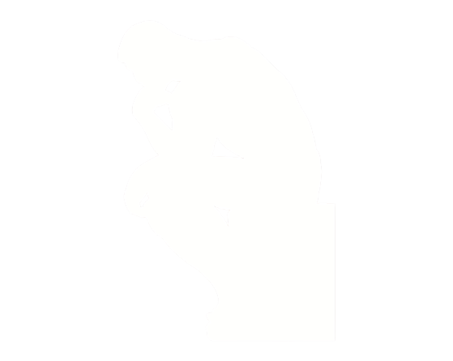

So today I had an existential crisis due to a single thought. You probably think you have infinite creativity like me. Everyone thinks their thoughts are not bound, right? Well, I just hit the boundary today. You are not creative. Or at least creativity is not what you think it is.

Wow, that was intense. If you freaked out, don't worry. Take a deep breath and relax. Let's play God. You have to imagine a new world or a new reality which is entirely different from ours. There are just 2 rules:

1. This new reality has to be entirely imagined by your brain alone without using any external tool that generates entropy.
2. The constructs of this world should not be borrowed from ours i.e., the reality should be 100% unique i.e., don't copy

Seems simple eh? Well let's start with some basic imagination

## playing god

1. The creatures here look like blobs and have no shape. Is this valid?

   - Nope. You know what a blob is because it exists in your world. Imagine a world which had perfect geometric shapes for everything. If you lived there, do you think you would know what a blob is? In short, you copied.
   - Now imagine a completely fantastical form of objects which is neither perfectly geometric and neither curvy or neither a mix of the two. Can you?

2. The speed of light in that world is exactly 1 km/h.

   - You copied again my friend. How do you know energy propagates through electromagnetic radiation in the first place. Heck, how will energy be defined in that world, is it even conserved? Oh! and what if there is nothing like energy!
   - Think of a completely fantastical form of an entity which propagates in a completely fantastical fashion. Oh no! what does propagation even mean? Will it even exist?

3. This world exists on a 2-dimensional plane.

   - What is a plane in that world? Is it i hat and j hat? But what if mathematics had to be different. Can you think of a completely fantastical form of mathematics and logic from scratch that doesn't use the axioms that we do?

## ouch

So your brain hurts now. It's as if . . . as if it can't just think anymore. It hit the boundary of imagination. Are you creative enough? I don't think so. There is always THE BOX at some point because you can't think out of THE BOX of our UNIVERSE. Anyways, to be open to possibilities, email me if you ever come up with something out of THE BOX.
